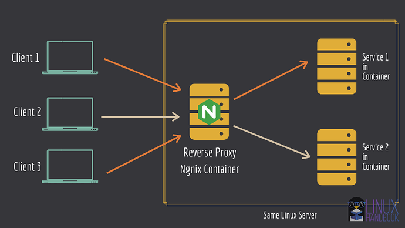

1
Screenshot — App at https://localhost on Vm OR https://192.168.148.130

2
Screenshot — docker compose ps

3
Screenshot — curl /api/health

Architecture : 

                ┌──────────────┐
                │    Client     │
                │  Browser/API  │
                └──────┬───────┘
                       │
                       ▼
               ┌──────────────┐
               │    NGINX     │
               │ ReverseProxy │
               │ LoadBalancer │
               └──────┬───────┘
                      │
        ┌─────────────┴─────────────┐
        ▼                           ▼
 ┌────────────┐              ┌────────────┐
 │  Flask1    │              │  Flask2    │
 │  Backend   │              │  Backend   │
 └─────┬──────┘              └─────┬──────┘
       │                           │
       ├──────────────┬────────────┤
       ▼              ▼            ▼
 ┌─────────┐    ┌──────────┐   ┌─────────┐
 │  Redis  │    │ Postgres │   │ pgAdmin │
 │  Cache  │    │ Database │   │ (tools) │
 └─────────┘    └──────────┘   └─────────┘

Networks:
- frontend
- backend

Volumes:
- pgdata
- redisdata